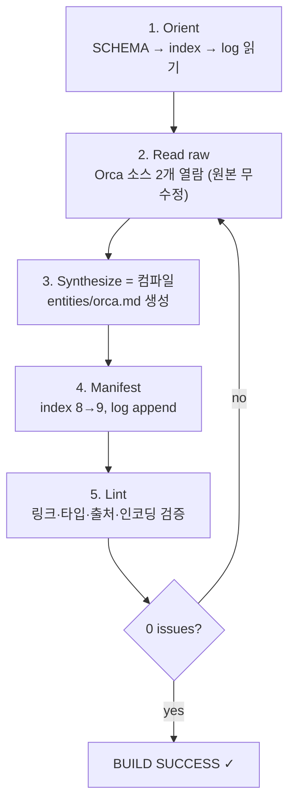

# LLM Wiki 컴파일, 빌드 파이프라인으로 이해하기

> Spring Boot / Next.js 개발자를 위한 설명 문서. 이 저장소의 "LLM Wiki 컴파일"이
> 실제로 무엇을 하는지 익숙한 빌드 개념에 빗대어 설명한다.
>
> **성격:** `docs/` 산출물(deliverable). canonical 위키 evidence가 아니며
> `index.md`/`log.md`에 등재되지 않는다. 원리 설명용이다.
>
> 렌더된 시각 자료: [`llm-wiki-compile-explained.html`](./llm-wiki-compile-explained.html)

## 한 줄 핵심

**LLM Wiki 컴파일 = `next build` / `mvn package`.**

새로운 개념이 아니라, 소스를 읽어 → 규칙에 맞춰 → 산출물을 만들고 → 검증하는
빌드 파이프라인과 구조가 같다.

## RAG vs LLM Wiki = SSR vs SSG

가장 중요한 직관.

| | 동작 | 비유 |
| --- | --- | --- |
| **RAG** | 질문마다 원본을 처음부터 검색해 답을 조립 | `getServerSideProps` — 요청 시점에 매번 렌더. 느리고 매번 새로 |
| **LLM Wiki** | 지식을 한 번 합성해 canonical 페이지로 굳혀둠 | `next build` / `getStaticProps` — 빌드 타임에 미리 만들어 계속 재사용 |

RAG가 매 요청을 SSR로 렌더한다면, LLM Wiki는 한 번 컴파일해 재사용하는 SSG다.

## 3계층 = 소스 / 산출물 / 설정

| 계층 | 이 저장소 | Next.js | Spring Boot |
| --- | --- | --- | --- |
| **Layer 1** 원본(immutable) | `raw/` | `public/` + 외부 API 데이터 (읽기 전용) | DB · resources (source of truth, 무수정) |
| **Layer 2** 컴파일 산출물 | `entities/` `concepts/` … | `.next/` 빌드 출력 | `target/` 컴파일된 Bean |
| **Layer 3** 설정 + 매니페스트 | `SCHEMA.md` · `index.md` · `log.md` | `next.config.js` + `routes-manifest.json` | `application.yml` + `ApplicationContext` |

## 컴파일 파이프라인 (Orca PoC에서 실제로 돌린 흐름)



| 단계 | 이 저장소가 한 일 | Next.js | Spring Boot |
| --- | --- | --- | --- |
| 1. Orient | 규칙·기존 상태 로드 (`SCHEMA`/`index`/`log`) | 빌드 설정 + 매니페스트 로드 | `@Configuration` 스캔 |
| 2. Read raw | raw 2개 열람, **원본 절대 수정 안 함** | `public/` read-only | DB record 조회 (dirty 없음) |
| 3. Synthesize | `entities/orca.md` 생성 | 소스 → `.next/` 트랜스파일 | `@Entity` → 컴파일된 Bean |
| 4. Manifest | `index` 8→9, `log` append | `routes-manifest.json` 갱신 + 빌드 로그 | Bean 레지스트리 등록 |
| 5. Lint | 계약 위반 0건 검증 | `next lint` + `tsc --noEmit` | `mvn verify` (checkstyle + test) |

## 용어 1:1 매핑

| LLM Wiki | Next.js | Spring Boot |
| --- | --- | --- |
| frontmatter 9필드 | `interface` / TS 타입 | `@Entity` + `@NotNull` |
| `[[wikilink]]` | `import` / `<Link>` | `@Autowired` 주입 |
| 2링크 최소 규칙 | orphan / dead-code 금지 | 고립 Bean 금지 |
| `^[raw/…]` 출처마커 | source map | 추적 가능한 origin |
| tag 택소노미 | 허용된 enum / union 타입 | 화이트리스트 enum |
| lint 0 issues | build passed ✓ | BUILD SUCCESS ✓ |

## 빌드 결과 (Orca PoC)

```text
$ llm-wiki compile —— PASS, 0 issues

✓ +1 산출물   entities/orca.md (첫 entity 페이지)
✓ 매니페스트   index 총계 8 → 9, 파일 수와 일치
✓ 링크 해석   아웃바운드 2개 모두 resolve, broken 0
✓ 출처        claim 마커 4개 전부 raw 경로로 resolve
✓ 타입/태그   frontmatter 9필드 OK, 등록 태그만 사용
✓ 인코딩      UTF-8 · LF · 최종개행 OK (46줄)
```

## 요약

`raw` = 소스, canonical = 빌드 산출물, `SCHEMA` = 빌드 설정, `lint` = `mvn verify`.
RAG가 매번 SSR로 렌더한다면, LLM Wiki는 `next build`로 한 번 컴파일해 재사용하는 SSG다.
