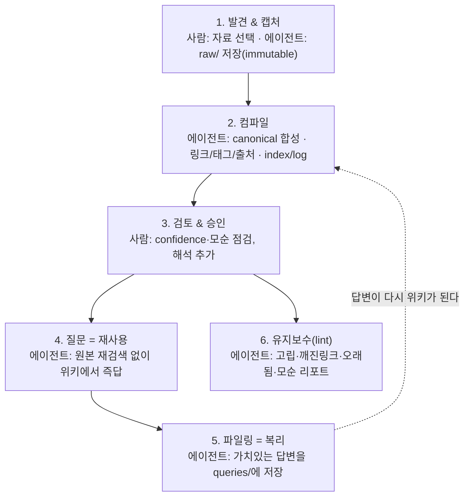

# LLM Wiki 사용자 플로우 — 사람은 큐레이션, 에이전트는 컴파일

> 사람이 이 위키를 실제로 어떻게 쓰는지 보여주는 설명 문서. 컴파일 내부 동작은
> [`llm-wiki-compile-explained.md`](./llm-wiki-compile-explained.md)를 참고.
>
> **성격:** `docs/` 산출물(deliverable). canonical evidence가 아니며 `index.md`/`log.md`에 등재되지 않는다.
>
> 렌더된 시각 자료: [`llm-wiki-user-flow.html`](./llm-wiki-user-flow.html)

## 핵심 원칙

LLM Wiki는 자동 지식 생성기가 **아니다**. 분업 구조다.

- **사람 = 큐레이터·디렉터** — 무엇이 중요한지, 무엇을 믿을지 판단.
- **에이전트 = 요약·연결·정리·검증** — 반복 노동을 지치지 않고 수행.

이 경계가 흐려지면 위키는 중복 페이지 더미로 퇴화한다. 그래서 `SCHEMA.md`라는
계약이 에이전트의 자유를 제한한다.

## 한 자료의 라이프사이클

| 단계 | 사람 | 에이전트 |
| --- | --- | --- |
| **1. 발견 & 캡처** | 흥미로운 글·영상·논문 → "이거 넣어줘" | 원본을 `raw/`에 저장 + 출처·해시, 이후 무수정 |
| **2. 컴파일** | 개입 없음 (맡겨둠) | 소스 읽고 canonical 합성, 링크·태그·출처, `index`/`log` 갱신 |
| **3. 검토 & 승인** | `confidence`·모순 점검, 개인 해석 추가 후 승인 | 낮은 신뢰도·모순 페이지 표면화 |
| **4. 질문 = 재사용** | 도메인 질문 (몇 주 뒤라도) | 원본 재검색 없이 즉답, "`[[page]]` 기준…" |
| **5. 파일링 = 복리** | "이 답변 저장해둬" (아까운 것만) | 답변을 `queries/`에 저장 → 다음 질문의 재료 |
| **6. 유지보수** | 주기적 "위키 점검해줘" | 고립·깨진 링크·오래됨·모순 리포트 |

## 복리(compounding) 효과

5단계에서 파일링된 답변이 2단계의 새 입력이 된다. 질문할수록 위키가 두꺼워지고,
다음 질문의 답이 더 빨라진다. 이게 매번 처음부터 검색하는 RAG와 갈리는 지점이다.

## 요약

**사람 = 판단, 에이전트 = 노동.** 사람은 방향과 신뢰를 정하고, 에이전트는 요약·교차참조·
일관성·검증이라는 반복 작업을 맡는다. `SCHEMA.md`가 그 분업의 계약서다.
